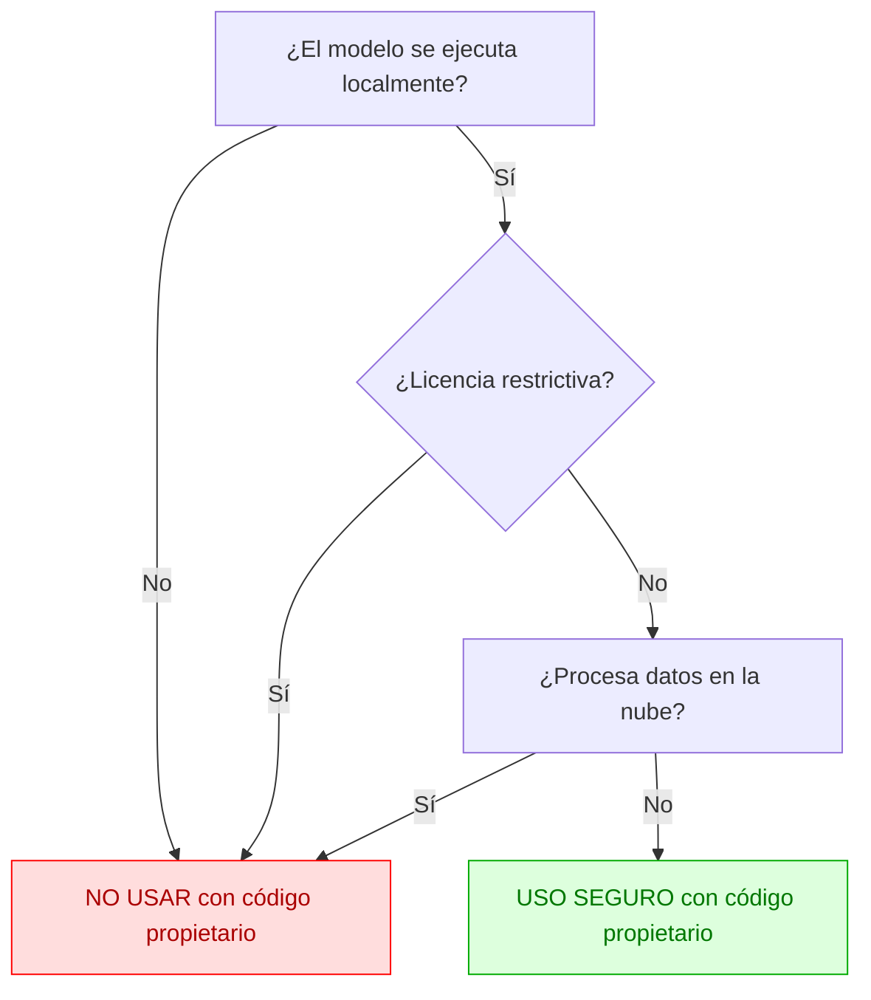

# Copyright y Modelos de IA: Uso Seguro con Código Propietario

## Resumen

Este documento resume qué modelos de IA pueden usarse de forma segura con código fuente propietario y cuáles no, considerando tanto modelos open source como comerciales/de pago.

---

## Tabla de Compatibilidad de Modelos

| Modelo / Servicio         | ¿Procesa en la nube? | ¿Licencia restrictiva? | ¿Apto para código propietario? | Notas clave                                  |
|--------------------------|:-------------------:|:----------------------:|:------------------------------:|----------------------------------------------|
| **ChatGPT (web/app)**        |        Sí           |         Sí             |              ❌                | Tus datos van a servidores de OpenAI         |
| **Copilot (web/app)**        |        Sí           |         Sí             |              ❌                | Tus datos van a Microsoft                    |
| **OpenAI API (GPT-4)**       |        Sí           |         Sí             |              ❌                | No es open source, sujeto a TOS              |
| **Gemini API**               |        Sí           |         Sí             |              ❌                | No es open source, sujeto a TOS              |
| **LLaMA 1 (Meta, original)** |        No           |         Sí             |              ❌                | Solo uso investigativo, no comercial         |
| **Modelos “research only”**  |        No           |         Sí             |              ❌                | Prohibido uso comercial                      |
| **Modelos sin licencia**     |        No           |         Sí             |              ❌                | No usar sin licencia clara                   |
| **Llama 2 (local)**          |        No           |         No             |              ✅                | Uso local permitido, licencia Meta           |
| **Deepseek-Coder (local)**   |        No           |         No             |              ✅                | Apache 2.0, uso comercial permitido          |
| **Mistral (local)**          |        No           |         No             |              ✅                | Apache 2.0                                   |
| **Mixtral (local)**          |        No           |         No             |              ✅                | Apache 2.0                                   |
| **CodeLlama (local)**        |        No           |         No             |              ✅                | Uso local permitido, licencia Meta           |

---

## Diagrama de Decisión de Uso Seguro

---

## Ejemplos de Modelos NO Recomendados

- ChatGPT (web/app)
- GitHub Copilot
- OpenAI API (GPT-4, GPT-3.5)
- Google Gemini API
- Amazon CodeWhisperer
- Modelos “research only” o “non-commercial”
- Modelos sin licencia clara

---

## Ejemplos de Modelos Recomendados (local y open source)

- Llama 2 (Meta, Community License)
- Deepseek-Coder (Apache 2.0)
- Mistral, Mixtral (Apache 2.0)
- CodeLlama (Meta, Community License)
- Phi-2 (Microsoft, MIT)
- StarCoder, WizardCoder (OpenRAIL-M)
- Gemma (Google, Apache 2.0)

---

## Recomendaciones Finales

- **Nunca uses modelos que procesen tu código en la nube si necesitas confidencialidad.**
- **Evita modelos con licencias “research only”, “non-commercial” o sin licencia clara.**
- **Prefiere modelos open source con licencias permisivas y ejecútalos localmente.**
- **Lee siempre la licencia oficial antes de usar cualquier modelo.**
- **Consulta con el departamento legal si tienes dudas.**

---

> **Nota:** Este documento es orientativo y no sustituye el asesoramiento legal profesional.