# System Architecture

## Overview
SICCOD follows a three-tier architecture pattern, utilizing PowerBuilder for the presentation layer and Jaguar server for distributed component management.

## Architecture Diagram

```mermaid
graph TB
    subgraph Presentation Layer
        MDI[MDI Main Window]
        W_Forms[Window Forms]
        DataWindows[DataWindows]
    end

    subgraph Business Layer
        subgraph Application Package
            BO_Interlocutor[Business Object: Interlocutor]
            BO_Maquinas[Business Object: Máquinas]
            BO_Local[Business Object: Local]
            BO_Modelo[Business Object: Modelo]
            BO_LocalInterloc[Business Object: Local-Interlocutor]
        end

        subgraph System Package
            SO_Security[Security System]
            SO_PermVentana[Window Permissions]
            SO_QueryMode[Query Mode]
        end

        subgraph Data Package
            DO_CRM[CRM Data Objects]
            DO_Security[Security Data Objects]
            DO_LogError[Error Logging]
        end
    end

    subgraph External Systems
        CRM[CRM System]
        SAP[SAP System]
        Jaguar[Jaguar Server]
    end

    MDI --> W_Forms
    W_Forms --> DataWindows
    DataWindows --> BO_Interlocutor
    DataWindows --> BO_Maquinas
    DataWindows --> BO_Local
    DataWindows --> BO_Modelo
    DataWindows --> BO_LocalInterloc

    BO_Interlocutor --> DO_CRM
    BO_Maquinas --> DO_CRM
    BO_Local --> DO_CRM
    BO_Modelo --> DO_CRM
    BO_LocalInterloc --> DO_CRM

    BO_Interlocutor --> SO_Security
    BO_Maquinas --> SO_Security
    BO_Local --> SO_Security
    BO_Modelo --> SO_Security
    BO_LocalInterloc --> SO_Security

    SO_Security --> DO_Security
    SO_PermVentana --> DO_Security
    SO_QueryMode --> DO_LogError

    DO_CRM --> CRM
    DO_CRM --> SAP
    DO_Security --> Jaguar
```

## Components

### 1. Presentation Layer
- **MDI Main Window**: Main application window
- **Window Forms**: Entity-specific forms
- **DataWindows**: Data presentation and editing components

### 2. Business Layer
#### Application Package
- Business objects for each entity
- Business logic implementation
- Data validation rules

#### System Package
- Security management
- Window permissions
- Query mode handling

#### Data Package
- CRM integration
- Security data management
- Error logging

### 3. External Systems
- **CRM System**: Customer relationship management
- **SAP System**: Enterprise resource planning
- **Jaguar Server**: Distributed component management

## Package Structure
- `siccod`: Main application package
- `syscod`: System package
- `datcod`: Data package
- `inforcod`: Information package
- `evacod`: Evaluation package

## Integration Points
1. **CRM Integration**
   - Customer data synchronization
   - Transaction management
   - Business process integration

2. **SAP Integration**
   - Financial data management
   - Business partner management
   - Material management

3. **Jaguar Server Integration**
   - Distributed component management
   - Security management
   - Transaction management

## Security Architecture
- User authentication
- Role-based access control
- Transaction security
- Data encryption

## Error Handling
- Comprehensive error logging
- Transaction rollback
- Error recovery mechanisms
- User notification system 