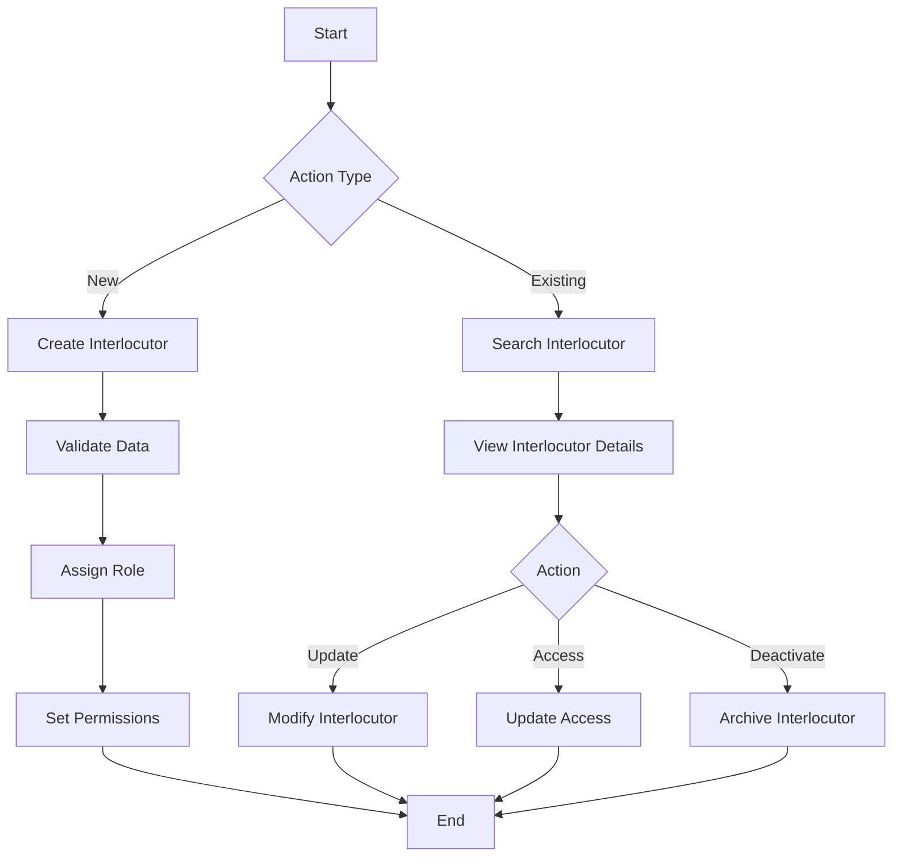
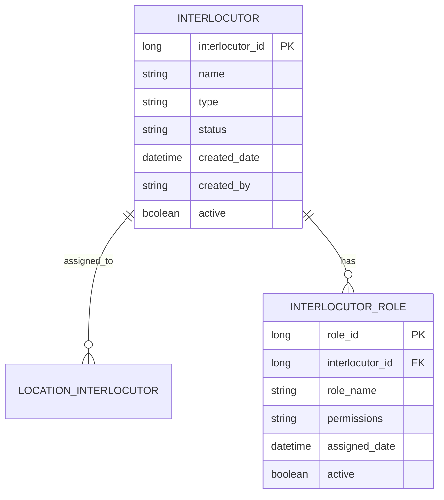

# Interlocutor Management

## Overview
The Interlocutor Management module handles the creation, maintenance, and lifecycle of business interlocutors, including their relationships with locations and access rights.

## Process Flow


## Entity Diagram


## Business Rules
1. Each interlocutor must have a unique identifier
2. Interlocutor type must be predefined
3. Role assignments must be tracked
4. Status changes must be logged

## Technical Implementation
### Data Access Layer
- Jaguar server components for interlocutor operations
- Stored procedures for CRUD operations
- Role management system
- Access control system

### User Interface
- Interlocutor search and filtering
- Interlocutor details view
- Role assignment interface
- Access management interface

## Integration Points
- Location Management System
- Role Management System
- Access Control System
- Audit System

## Security Considerations
- Role-based access control
- Permission validation
- Audit logging
- Data encryption

## Data Structure

### Basic Information
```powerbuilder
// Basic Information Fields
dw_1.object.intid[1]           // Internal ID
dw_1.object.crmintid[1]        // CRM ID
dw_1.object.intnombre[1]       // Name
dw_1.object.intdninif[1]       // DNI/NIF
dw_1.object.intvtonicnif[1]    // ID Expiration Date
```

### Address Information
```powerbuilder
// Address Fields
dw_1.object.viaid[1]           // Street ID
dw_1.object.intnomvia[1]       // Street Name
dw_1.object.intnumvia[1]       // Street Number
dw_1.object.intescvia[1]       // Building
dw_1.object.intpisvia[1]       // Floor
dw_1.object.intpuevia[1]       // Door
dw_1.object.pobsid[1]          // City ID
dw_1.object.pobcodpos[1]       // Postal Code
```

### Contact Information
```powerbuilder
// Contact Fields
dw_1.object.inttelef1[1]       // Primary Phone
dw_1.object.inttelef2[1]       // Secondary Phone
dw_1.object.inttelefm[1]       // Mobile Phone
dw_1.object.intteleff[1]       // Fax
dw_1.object.intpagweb[1]       // Website
dw_1.object.inte_mail[1]       // Email
```

## Business Rules

### Legal Entity Type Processing
```powerbuilder
CHOOSE CASE Upper(ls_entidad_legal)
    CASE 'SOCIEDAD CIVIL'
        dw_1.object.intentlegal[1] = 'SC'
    CASE ELSE
        if Pos(ls_entidad_legal, 'SICA') > 0 then
            dw_1.object.intentlegal[1] = 'PF'
        else
            if Pos(ls_entidad_legal, 'DICA') > 0 then
                dw_1.object.intentlegal[1] = 'PJ'
            else
                if Pos(ls_entidad_legal, 'BIEN') > 0 then
                    dw_1.object.intentlegal[1] = 'CB'
                end if
            end if
        end if
END CHOOSE
```

### Language Preference Processing
```powerbuilder
CHOOSE CASE Trim(Upper(app.is_parametros[29]))
    CASE 'CASTELLANO'
        dw_1.Object.intidioma[1] = 1
    CASE 'CATALAN', 'CATALÁN'
        dw_1.Object.intidioma[1] = 2
    CASE 'EUSKERA'
        dw_1.Object.intidioma[1] = 3
    CASE 'GALLEGO'
        dw_1.Object.intidioma[1] = 4
    CASE 'VALENCIANO'
        dw_1.Object.intidioma[1] = 5
END CHOOSE
```

## Integration Points

### SAP Integration
```powerbuilder
// SAP Integration Fields
dw_1.Object.intsaprh[1]    // SAP Partner
dw_1.Object.intsapter[1]   // SAP Territory
dw_1.Object.intsapacre[1]  // SAP Account
dw_1.Object.codempleadosap[1]  // SAP Employee Code
```

### Zone Management
```powerbuilder
public function integer of_retrieve_zonas (long al_intid)
    // Retrieve zone information for the interlocutor
    // Update zone assignments
    // Process zone history
end function
```

## Validation Rules

### ID Validation
- DNI/NIF format validation
- Expiration date check
- Duplicate ID check

### Address Validation
- Required fields check
- Postal code format
- City existence validation

### Contact Validation
- Phone number format
- Email format
- Website format

## Business Rules
- Legal entity type validation
- Language preference validation
- SAP integration validation
- Zone assignment validation

## Security Rules
- User permission check
- Data access validation
- Audit trail maintenance

## Error Handling
```powerbuilder
try
    // Process data
catch ( corbasystemexception e )
    // Handle system errors
    RemoteObject.of_SetAbort()
end try
```

## Best Practices
1. Always validate required fields
2. Check for duplicate entries
3. Maintain audit trail
4. Handle errors gracefully
5. Follow security guidelines
6. Keep data synchronized with external systems
7. Document all changes 