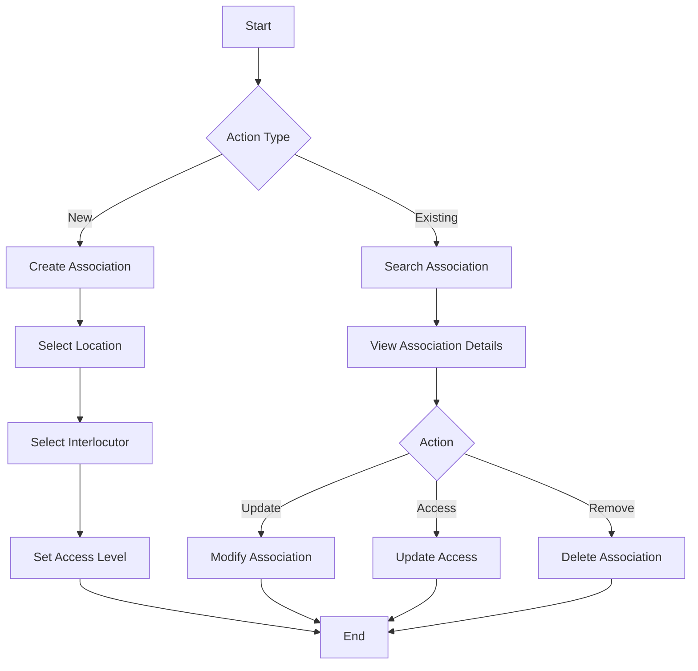
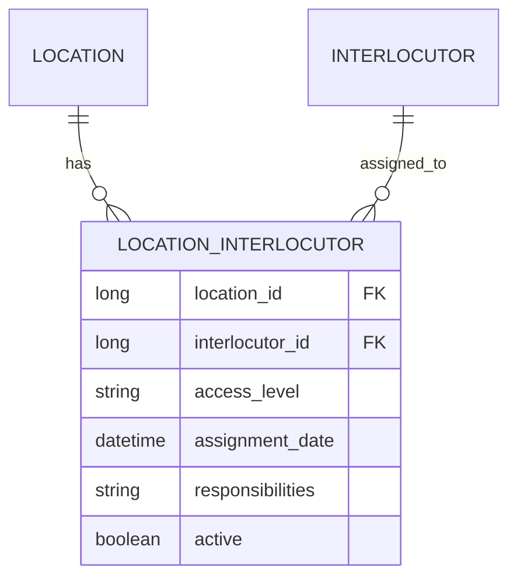

# Location-Interlocutor Management

## Overview
The Location-Interlocutor Management module handles the relationships between locations and their associated interlocutors, managing access and responsibilities.

## Process Flow

## Entity Diagram

## Business Rules
1. Each location can have multiple interlocutors
2. Access levels must be predefined
3. Assignment dates must be tracked
4. Responsibilities must be documented

## Technical Implementation
### Data Access Layer
- Jaguar server components for association operations
- Stored procedures for CRUD operations
- Access control management

### User Interface
- Association management interface
- Access level configuration
- Responsibility assignment
- Assignment history view

## Integration Points
- Location Management System
- Interlocutor Management System
- Access Control System
- Audit System

## Security Considerations
- Access level validation
- Assignment authorization
- Responsibility tracking
- Audit logging 