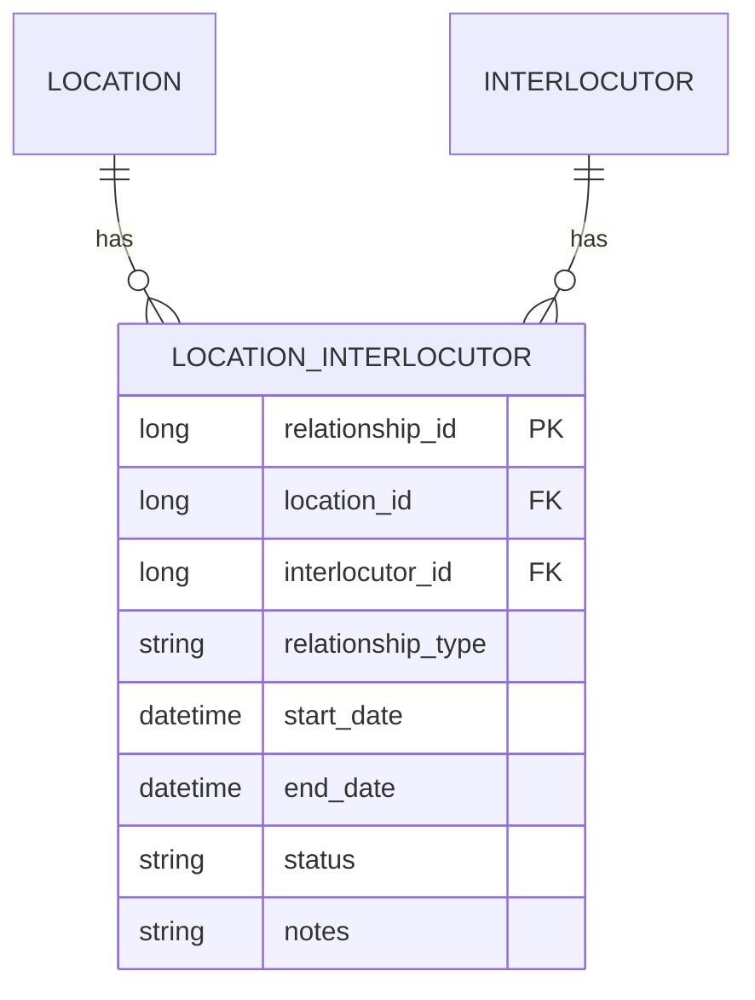

# Location-Interlocutor Management

## Overview
The Location-Interlocutor Management module handles the relationships between business locations and their associated interlocutors, managing different types of relationships and their lifecycle.

## Entity Diagram

## Business Rules
1. Each relationship must have a valid start date
2. Relationship types must be predefined
3. Multiple relationships can exist between location and interlocutor
4. Relationship status must be one of: Active, Inactive, Pending, Terminated

## Technical Implementation
### Data Access Layer
- Jaguar server components for relationship management
- Stored procedures for CRUD operations
- Relationship validation rules

### User Interface
- Relationship search and filtering
- Relationship details view
- Relationship type management
- Timeline view of relationships

## Integration Points
- Location Management System
- Interlocutor Management System
- Contract Management System
- Document Management System

## Security Considerations
- Relationship data access control
- Historical relationship tracking
- Audit trail for relationship changes
- Role-based access to relationship management 