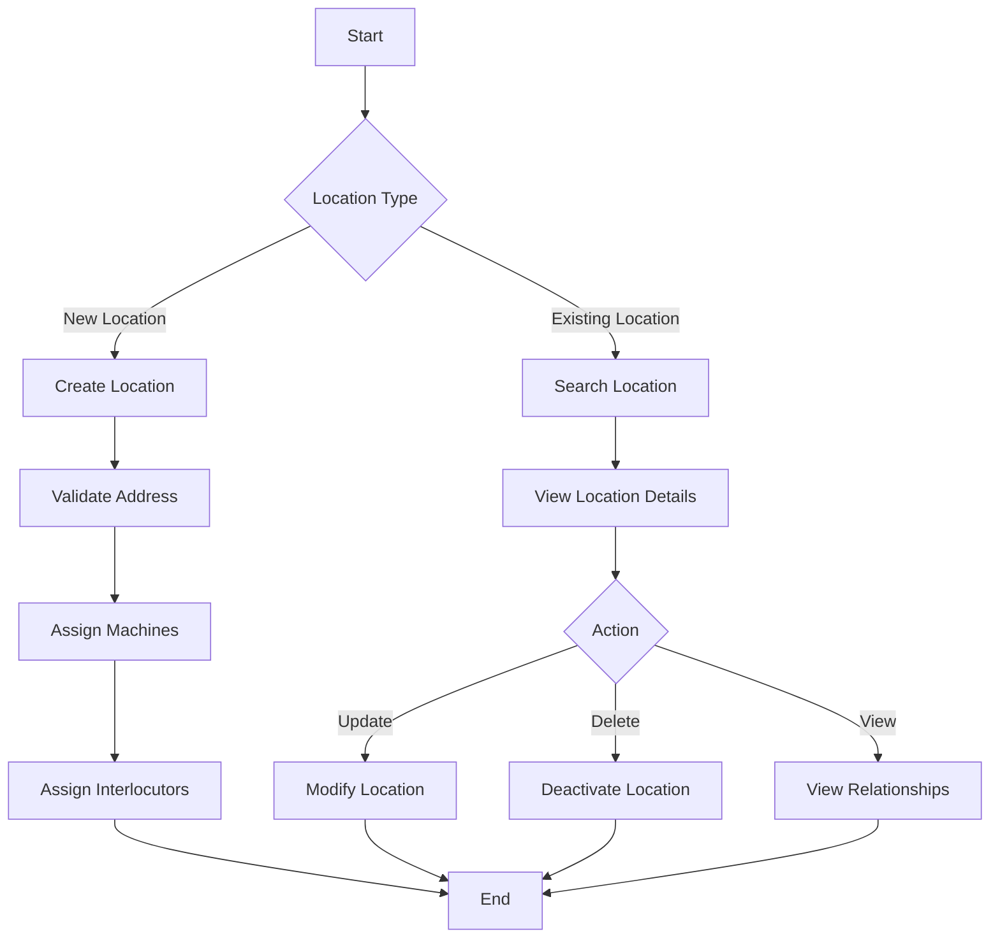
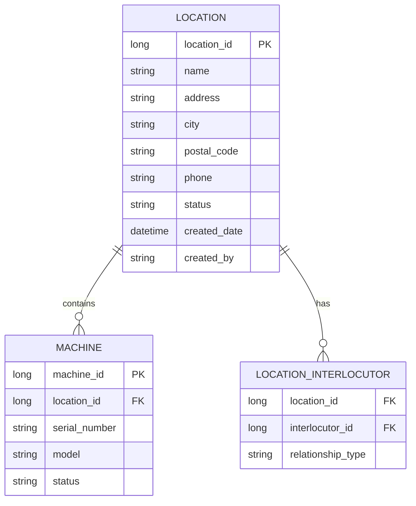

# Location Management

## Overview
The Location Management module handles all aspects of physical business locations, including their relationships with machines, interlocutors, and other business entities.

## Process Flow

## Entity Diagram

## Business Rules
1. Each location must have a unique identifier
2. Locations can have multiple machines
3. Locations can have multiple interlocutors
4. Location status must be one of: Active, Inactive, Pending, Suspended

## Technical Implementation
### Data Access Layer
- Uses Jaguar server components for data access
- Implements CRUD operations through stored procedures
- Handles location validation and business rules

### User Interface
- Location search and filtering
- Location details view
- Machine assignment interface
- Interlocutor relationship management

## Integration Points
- Machine Management System
- Interlocutor Management System
- Geographic Information System
- Address Validation Service

## Security Considerations
- Location data access is role-based
- Sensitive location information is encrypted
- Audit trail for all location modifications 