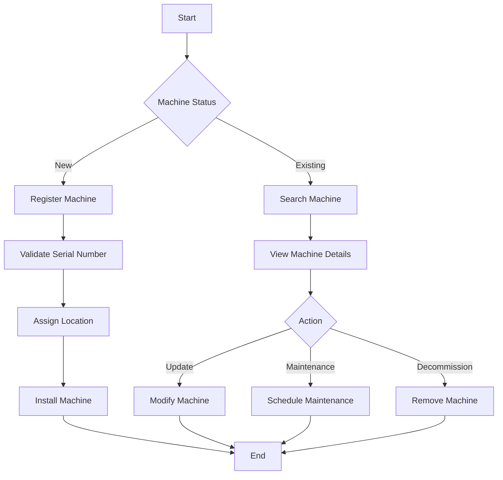

# Machine Management

## Overview
The Machine Management module handles the lifecycle of point-of-sale terminals, from installation to maintenance and decommissioning.

## Process Flow

## Entity Diagram

## Business Rules
1. Each machine must be associated with a valid model
2. Machine status must be one of: Active, Maintenance, Decommissioned
3. Regular maintenance schedule must be maintained
4. Firmware updates must be tracked

## Technical Implementation
### Data Access Layer
- Jaguar server components for machine operations
- Stored procedures for CRUD operations
- Maintenance scheduling system

### User Interface
- Machine search and filtering
- Machine details view
- Maintenance scheduling interface
- Firmware update management

## Integration Points
- Location Management System
- Model Management System
- Maintenance Service
- Firmware Update Service

## Security Considerations
- Machine access is role-based
- Maintenance records are audited
- Firmware updates require authorization
- Serial number validation 