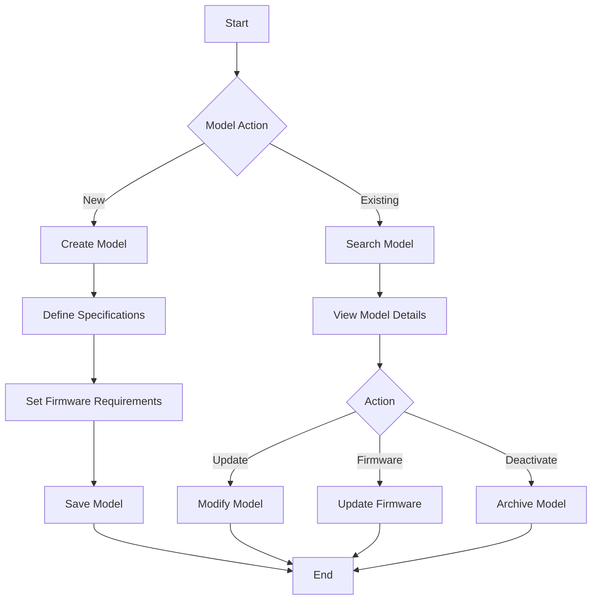
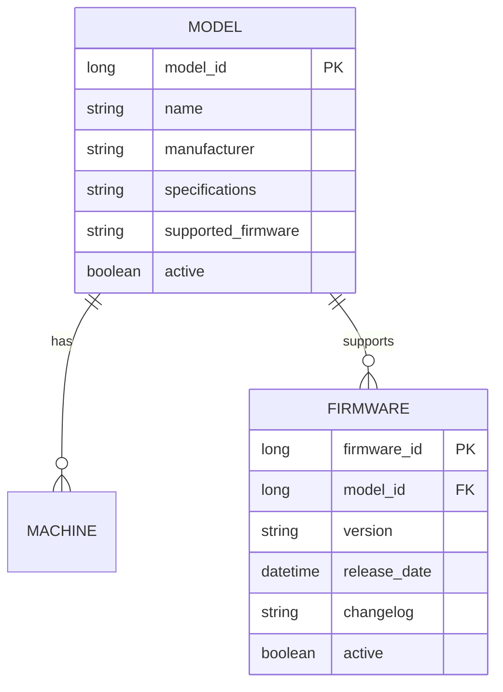

# Model Management

## Overview
The Model Management module handles the catalog of machine models, their specifications, and firmware compatibility.

## Process Flow

## Entity Diagram

## Business Rules
1. Each model must have unique specifications
2. Firmware versions must be compatible with model
3. Model deactivation requires validation
4. Firmware updates must be tested

## Technical Implementation
### Data Access Layer
- Jaguar server components for model operations
- Stored procedures for CRUD operations
- Firmware version control system

### User Interface
- Model catalog view
- Specification management
- Firmware compatibility matrix
- Model lifecycle management

## Integration Points
- Machine Management System
- Firmware Management System
- Inventory System
- Testing System

## Security Considerations
- Model specifications are versioned
- Firmware updates require testing
- Model deactivation requires approval
- Access control for model management 