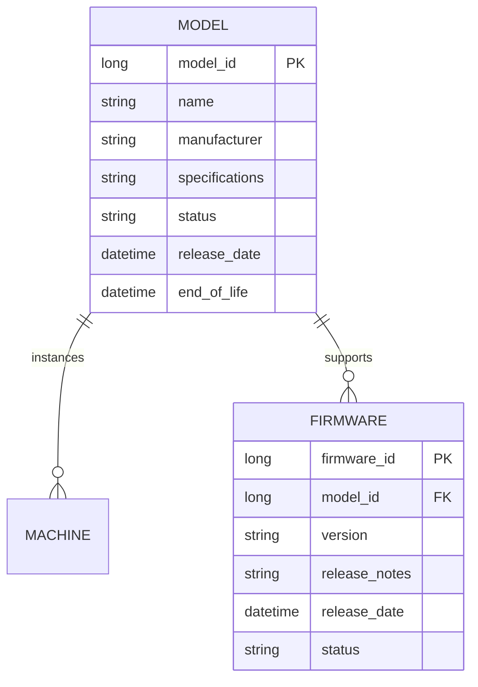

# Model Management

## Overview
The Model Management module handles the catalog of machine models, their specifications, and supported firmware versions.

## Entity Diagram

## Business Rules
1. Each model must have unique specifications
2. Model status must be one of: Active, Deprecated, End of Life
3. Firmware versions must be compatible with model specifications
4. End of life date must be set for deprecated models

## Technical Implementation
### Data Access Layer
- Jaguar server components for model operations
- Stored procedures for CRUD operations
- Firmware version management

### User Interface
- Model catalog view
- Model details and specifications
- Firmware version management
- Compatibility matrix

## Integration Points
- Machine Management System
- Firmware Update Service
- Manufacturer API
- Technical Documentation System

## Security Considerations
- Model specifications access control
- Firmware version validation
- Release date verification
- End of life notifications 