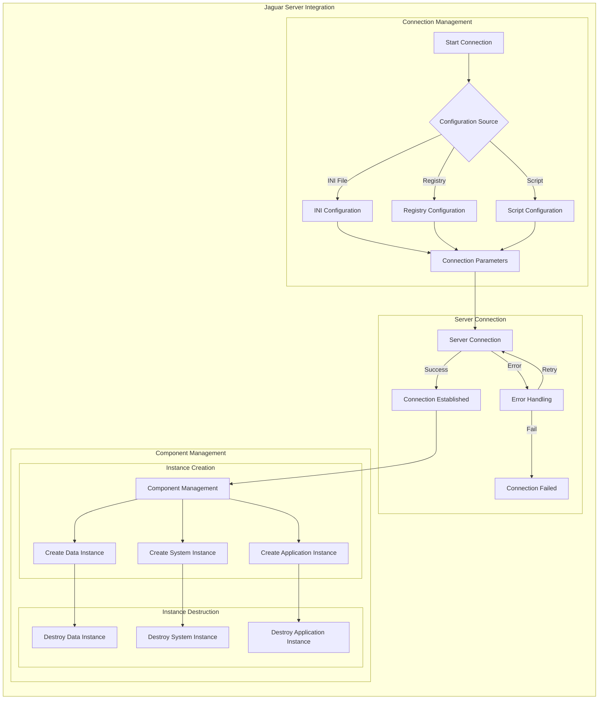

# Jaguar Server Integration

## Overview
The Jaguar server integration provides distributed component management, security, and transaction handling for the SICCOD system.

## Integration Diagram


## Configuration

### Connection Parameters
```powerbuilder
// Default connection parameters
Constant String CNT_Server = "XMI"
Constant String CNT_Port   = "9020"
Constant String CNT_UserID = "jagadmin"
Constant String CNT_PassWord = ""
```

### Configuration Sources
```powerbuilder
// Three possible configuration sources
CONSTANT string IS_USE_INIFILE     = "1"
CONSTANT string IS_USE_REGISTRY    = "2"
CONSTANT string IS_USE_SCRIPT      = "3"
```

## Component Management

### Instance Creation
```powerbuilder
protected function long of_createinstance (ref n_cst_srv_base newremoteobject, string as_paquete, string as_componente)
    // Create instance with package and component
    ls_ClassName = trim(as_Paquete) + "/" + trim(as_Componente)
    li_ret = CreateInstance(NewRemoteObject, ls_ClassName)
    
    // Load component properties
    NewRemoteObject.of_CargarPropiedades(App.srvUsers.Codi, App.srvUsers.Perfil, &
                                        App.JaguarOK, App.AppName)
end function
```

### Package-Specific Instance Creation
```powerbuilder
// Data Package Instance
public function long of_createinstancedatos (ref n_cst_srv_base newremoteobject, string as_componente)
    Return This.of_CreateInstance(NewRemoteObject, CNT_Package_Datos, as_componente)
end function

// System Package Instance
public function long of_createinstancesistema (ref n_cst_srv_base newremoteobject, string as_componente)
    Return This.of_CreateInstance(NewRemoteObject, CNT_Package_Sistema, as_componente)
end function

// Application Package Instance
public function integer of_createinstanceappl (ref n_cst_srv_base newremoteobject, string as_componente)
    Return This.of_CreateInstance(NewRemoteObject, CNT_Package_Appl, as_componente)
end function
```

## Package Structure

### 1. Data Package (CNT_Package_Datos)
- CRM Components
  - `n_cst_do_crm_interlocutor`
  - `n_cst_do_crm_local`
  - `n_cst_do_crm_maquina`
  - `n_cst_do_crm_modelo`
  - `n_cst_do_crm_localinterloc`
- Security Components
  - `n_cst_do_sistemaseguridad`
- Log Components
  - `n_cst_do_logerroraplic`

### 2. System Package (CNT_Package_Sistema)
- Security System
  - `n_cst_so_sistemaseguridad`
- Window Permissions
  - `n_cst_so_permventana`
- Query Mode
  - `n_cst_querymode`

### 3. Application Package (CNT_Package_Appl)
- Business Objects
  - `n_cst_bo_estructuragestion`
- Management Objects
  - `neg_interlocutor`
  - `neg_parametros`
- Utility Objects
  - Various utility components

## Error Handling

### Connection Errors
```powerbuilder
Choose Case li_ret
    Case 50
        ls_String = "50-Distributed service error"
    Case 52
        ls_String = "52-Distributed communications error"
    Case 53
        ls_String = "53-Requested server not active"
    // ... more error cases
End Choose
```

### Transaction Management
```powerbuilder
try
    RemoteObject.of_SetComplete()  // Commit transaction
catch ( corbasystemexception e )
    RemoteObject.of_SetAbort()     // Rollback transaction
end try
```

## Security Integration
```powerbuilder
// Security component initialization
App.inv_Connect.of_CreateInstanceSistema(lnv_so_seguridad, "n_cst_so_sistemaseguridad")
// Security checks
App.inv_Connect.of_CreateInstanceSistema(luo_so_permventana, "n_cst_so_permventana")
```

## Best Practices
1. Always check connection status before operations
2. Properly handle instance creation and destruction
3. Implement comprehensive error handling
4. Use transaction management for data consistency
5. Follow security guidelines for component access
6. Maintain proper logging for troubleshooting
7. Implement proper cleanup in error scenarios 