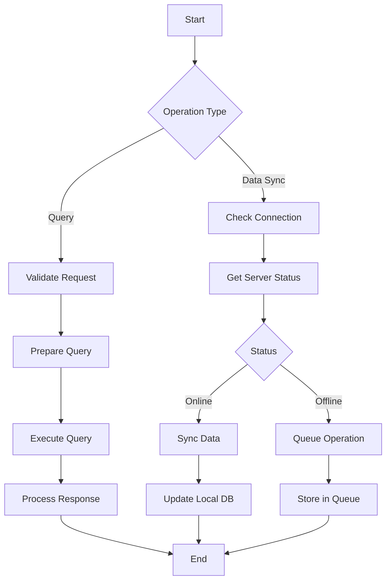
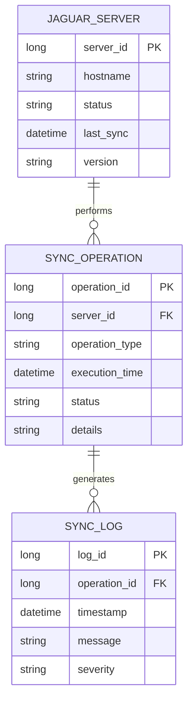
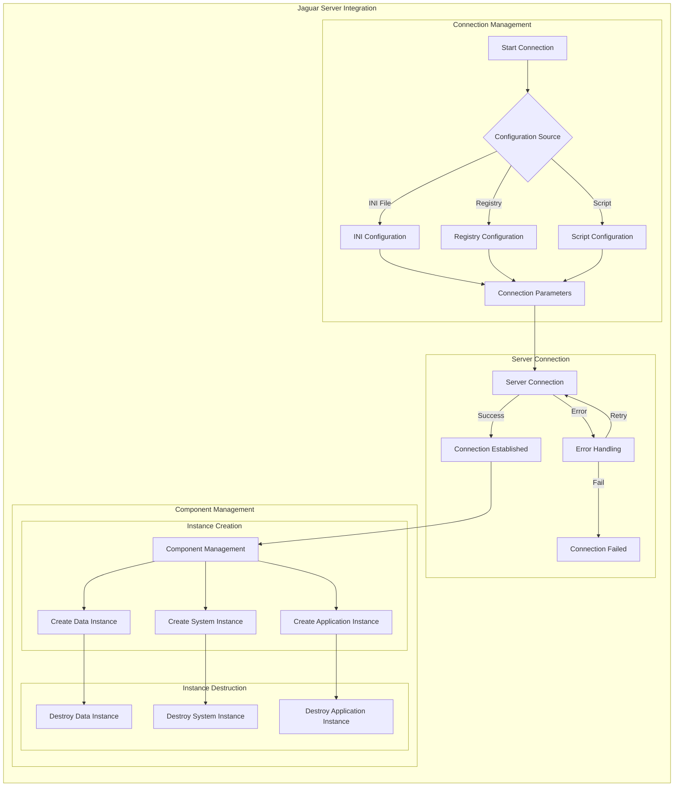

# Jaguar Server Integration

## Overview
The Jaguar Server Integration module manages the communication and data synchronization between the application and the Jaguar server infrastructure.

## Process Flow


## Entity Diagram


## Business Rules
1. Server connection must be validated before operations
2. Failed operations must be queued for retry
3. Sync operations must be logged
4. Server status must be monitored

## Technical Implementation
### Data Access Layer
- Jaguar server connection management
- Stored procedures for data operations
- Queue management system
- Logging system

### User Interface
- Server status monitoring
- Sync operation management
- Log viewer
- Queue management interface

## Integration Points
- Database Management System
- Queue Management System
- Logging System
- Monitoring System

## Security Considerations
- Secure server communication
- Operation authentication
- Data encryption
- Access control

## Integration Diagram


## Configuration

### Connection Parameters
```powerbuilder
// Default connection parameters
Constant String CNT_Server = "XMI"
Constant String CNT_Port   = "9020"
Constant String CNT_UserID = "jagadmin"
Constant String CNT_PassWord = ""
```

### Configuration Sources
```powerbuilder
// Three possible configuration sources
CONSTANT string IS_USE_INIFILE     = "1"
CONSTANT string IS_USE_REGISTRY    = "2"
CONSTANT string IS_USE_SCRIPT      = "3"
```

## Component Management

### Instance Creation
```powerbuilder
protected function long of_createinstance (ref n_cst_srv_base newremoteobject, string as_paquete, string as_componente)
    // Create instance with package and component
    ls_ClassName = trim(as_Paquete) + "/" + trim(as_Componente)
    li_ret = CreateInstance(NewRemoteObject, ls_ClassName)
    
    // Load component properties
    NewRemoteObject.of_CargarPropiedades(App.srvUsers.Codi, App.srvUsers.Perfil, &
                                        App.JaguarOK, App.AppName)
end function
```

### Package-Specific Instance Creation
```powerbuilder
// Data Package Instance
public function long of_createinstancedatos (ref n_cst_srv_base newremoteobject, string as_componente)
    Return This.of_CreateInstance(NewRemoteObject, CNT_Package_Datos, as_componente)
end function

// System Package Instance
public function long of_createinstancesistema (ref n_cst_srv_base newremoteobject, string as_componente)
    Return This.of_CreateInstance(NewRemoteObject, CNT_Package_Sistema, as_componente)
end function

// Application Package Instance
public function integer of_createinstanceappl (ref n_cst_srv_base newremoteobject, string as_componente)
    Return This.of_CreateInstance(NewRemoteObject, CNT_Package_Appl, as_componente)
end function
```

## Package Structure

### 1. Data Package (CNT_Package_Datos)
- CRM Components
  - `n_cst_do_crm_interlocutor`
  - `n_cst_do_crm_local`
  - `n_cst_do_crm_maquina`
  - `n_cst_do_crm_modelo`
  - `n_cst_do_crm_localinterloc`
- Security Components
  - `n_cst_do_sistemaseguridad`
- Log Components
  - `n_cst_do_logerroraplic`

### 2. System Package (CNT_Package_Sistema)
- Security System
  - `n_cst_so_sistemaseguridad`
- Window Permissions
  - `n_cst_so_permventana`
- Query Mode
  - `n_cst_querymode`