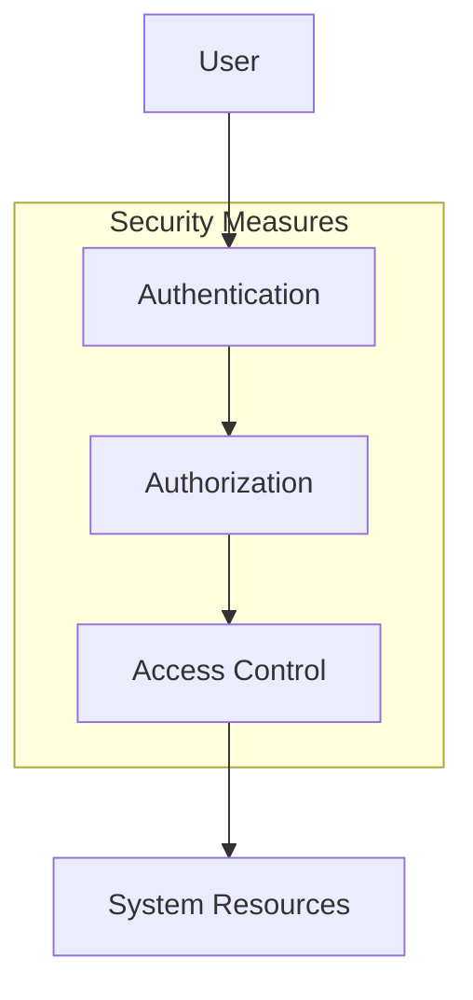
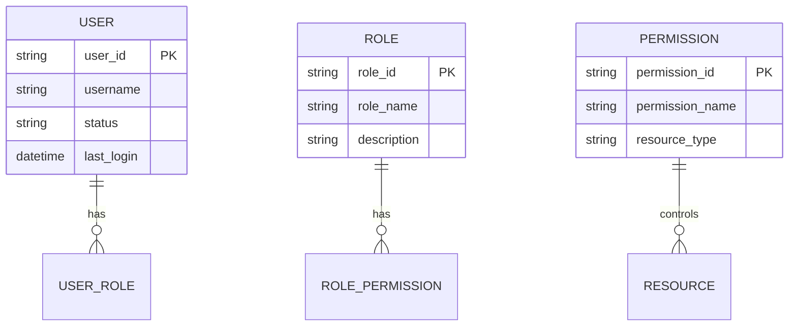

# Security and Access Control

## Overview
The Security and Access Control module manages user authentication, authorization, and system security measures.

## Security Architecture

## Authentication
### User Authentication
- Username/password authentication
- Password policies
- Session management
- Login attempt tracking

### Security Measures
- Password encryption
- Session timeout
- IP restrictions
- Two-factor authentication

## Authorization
### Role-Based Access Control

## Access Control
### Resource Protection
- Data access control
- Function access control
- Report access control
- API access control

### Security Policies
- Password requirements
- Session management
- Access logging
- Audit trails

## Security Implementation
### Data Security
- Data encryption
- Secure communication
- Data backup
- Data recovery

### System Security
- Network security
- Application security
- Database security
- API security

## Monitoring and Auditing
- Security event logging
- Access monitoring
- Security alerts
- Compliance reporting

## Security Procedures
### Incident Response
1. Detection
2. Analysis
3. Containment
4. Eradication
5. Recovery
6. Lessons learned

### Security Maintenance
- Regular security updates
- Vulnerability scanning
- Security testing
- Security training 