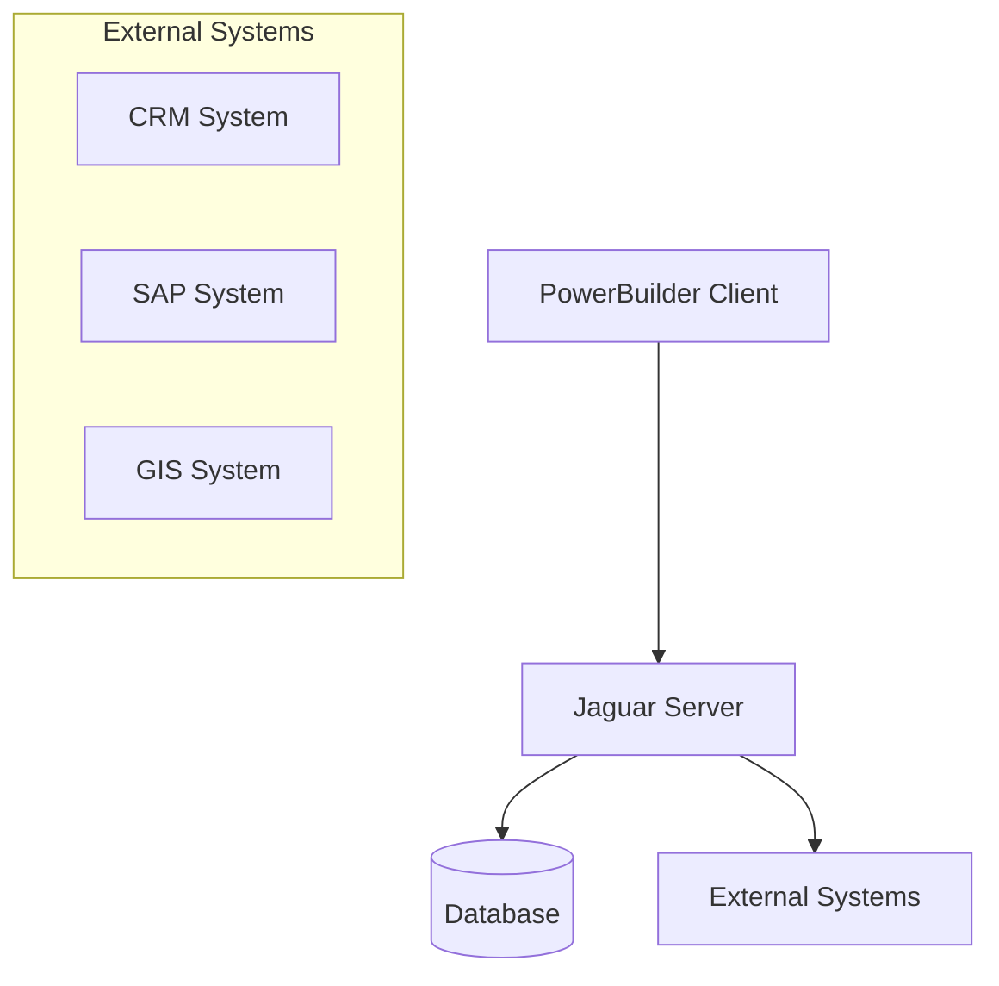

# Technical Implementation

## Overview
The Technical Implementation document details the system's architecture, development standards, and implementation guidelines.

## System Architecture

## Development Standards
### Code Organization
- Modular component design
- Clear separation of concerns
- Consistent naming conventions
- Comprehensive documentation

### Database Design
- Normalized database schema
- Optimized indexes
- Stored procedures for data access
- Transaction management

### Error Handling
- Centralized error management
- Detailed error logging
- User-friendly error messages
- Error recovery procedures

## Implementation Guidelines
### Component Development
1. Define component interface
2. Implement business logic
3. Add error handling
4. Write unit tests
5. Document component

### Database Operations
1. Use stored procedures
2. Implement transaction control
3. Handle concurrency
4. Optimize queries

### User Interface
1. Follow design guidelines
2. Implement validation
3. Add error handling
4. Ensure responsiveness

## Testing Strategy
- Unit testing
- Integration testing
- System testing
- Performance testing
- User acceptance testing

## Deployment Process
1. Development environment
2. Testing environment
3. Staging environment
4. Production environment

## Maintenance Procedures
- Regular backups
- Performance monitoring
- Security updates
- Bug fixes
- Feature enhancements 