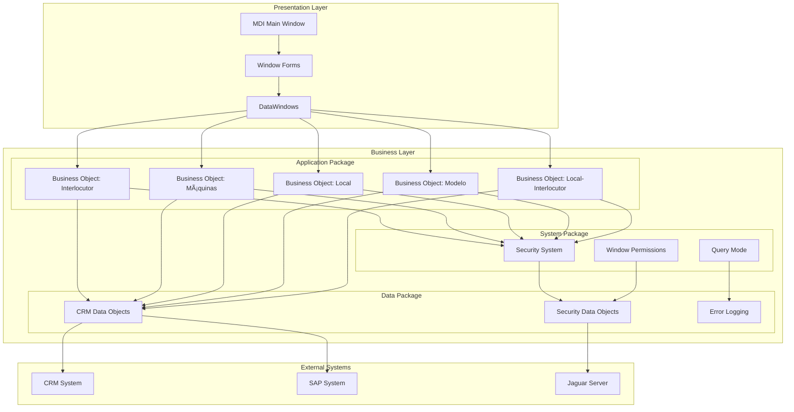

# SICCOD System Analysis

## 1. Domain Map

## 2. Component Dependencies

## 3. Business Process Flows

### 3.1 Interlocutor Management Process

### 3.2 Jaguar Server Integration Process

## 4. Key Functionalities

### 4.1 Core Functionalities
1. **Interlocutor Management**
   - Creation and maintenance of business contacts
   - Role assignment and permissions
   - Address and contact information management
   - Legal entity type processing

2. **Location Management**
   - Physical location registration
   - Machine assignment
   - Interlocutor relationships
   - Status tracking

3. **Machine Management**
   - Terminal registration and tracking
   - Maintenance scheduling
   - Firmware updates
   - Status monitoring

4. **Model Management**
   - Model catalog maintenance
   - Specification management
   - Firmware compatibility
   - Version control

### 4.2 Integration Functionalities
1. **Jaguar Server Integration**
   - Distributed component management
   - Connection management
   - Data synchronization
   - Error handling

2. **External System Integration**
   - CRM system integration
   - SAP system integration
   - GIS system integration
   - Legal entity system integration

### 4.3 Security Functionalities
1. **Access Control**
   - User authentication
   - Role-based permissions
   - Resource protection
   - Audit logging

2. **Data Security**
   - Data encryption
   - Secure communication
   - Backup and recovery
   - Access monitoring

## 5. Technical Implementation Details

### 5.1 Architecture
- Three-tier architecture (Presentation, Business, Data)
- PowerBuilder client-server implementation
- Jaguar server for distributed components
- Database-driven operations

### 5.2 Development Standards
- Modular component design
- Clear separation of concerns
- Consistent naming conventions
- Comprehensive documentation

### 5.3 Error Handling
- Centralized error management
- Detailed error logging
- User-friendly error messages
- Error recovery procedures

## 6. Integration Points

### 6.1 External Systems
- CRM System
- SAP System
- GIS System
- Legal Entity Management System

### 6.2 Internal Systems
- Database Management System
- Queue Management System
- Logging System
- Monitoring System 