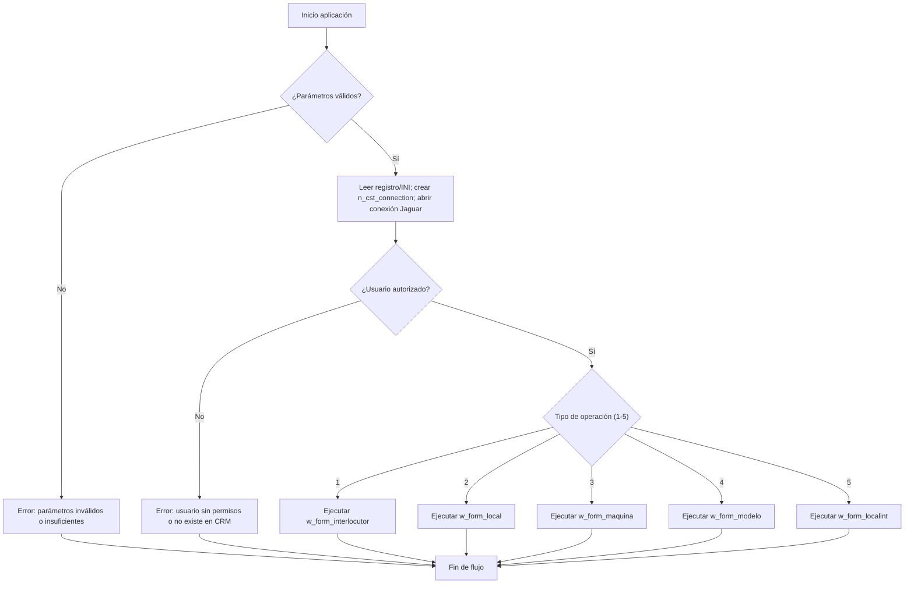

Great. I will generate a single functional document summarizing the mini-application provided in the PowerBuilder 12.5 Classic source code.

This document will include:

* A high-level functionality summary
* Input and output parameters
* Dependencies (other components, tables, environment variables)
* Detailed explanation of input, processing, validations, and output
* Test tree including input, processing, and output tests using Mermaid syntax
* Technical requirements (system, configuration, data access)

I’ll present it in Markdown format with Mermaid diagrams where applicable. I’ll let you know as soon as the document is ready for review.


# Documentación funcional – Aplicación SICCOD-CRM (PowerBuilder 12.5)

## Resumen de funcionalidad

La aplicación es un mini-aplicativo de integración CRM basado en PowerBuilder 12.5 Classic, que sincroniza datos entre el sistema SICCOD y el CRM Siebel. Se ejecuta en un entorno Jaguar/EAServer y utiliza una base de datos Informix. La interfaz principal es la ventana MDI **w\_siccod\_frame**, que crea un menú (*m\_mdi*) y un cliente MDI. Al iniciarse, el sistema lee los parámetros de entrada (cadena `CommandLine` con valores separados por `|`) y delega la tarea al `n_cst_mainclass`, que se encarga de la inicialización (conexión a Jaguar/EAServer e Informix, autenticación de usuario) y de lanzar la ventana de mantenimiento correspondiente. Según el tipo de operación (parámetro 1–5), se abre la ventana de mantenimiento adecuada: **w\_form\_interlocutor** (caso 1), **w\_form\_local** (2), **w\_form\_maquina** (3), **w\_form\_modelo** (4) o **w\_form\_localint** (5). Cada formulario permite crear o actualizar registros en la base Informix vía Jaguar/EAServer, y registrar cambios en el CRM (por ejemplo, mediante funciones integradas de Siebel).

El `n_cst_connection` se encarga de leer del registro de Windows los datos de conexión al servidor Jaguar (usuario, contraseña, servidor, puerto, aplicación) y abrir la conexión utilizando el driver Jaguar integrado. A su vez, se valida el usuario mediante el objeto **n\_cst\_so\_permventana** (verificando permisos y existencia en el sistema). Al finalizar la operación, la aplicación retorna un código de resultado en la variable **`il_codretorno`** (0=ok, otros valores indican errores) y cierra la ventana. Toda la lógica de negocio corre dentro del contenedor Sybase EAServer (antes Jaguar), el cual provee la ejecución de objetos PowerBuilder de manera centralizada.

## Parámetros de entrada/salida

* **Entrada:**

  * **Cadena de parámetros:** La aplicación recibe una sola cadena de texto (`CommandLine`) con campos separados por `|`. Por ejemplo:

    ```
    1|59113|1-7RAAH|LAS HOCES 2011, S.L.|B86099546|... 
    ```

    donde el primer campo (1–5) determina el tipo de mantenimiento y los siguientes campos contienen identificadores, nombres o valores según la operación.
  * **Claves del registro:** Se leen claves en `HKLM\SOFTWARE\CODERE\SICCODg\ConexionBBDD\`:

    * **DBMS:** tipo de driver de BD (por ejemplo `INFORMIX`).
    * **DBPARM:** cadena de conexión a la base Informix (host, puerto, base de datos).
      Además, bajo `HKLM\SOFTWARE\CODERE\SICCODg\` se hallan subclaves con los parámetros de Jaguar/EAServer: **UserID** (usuario), **PassWord**, **Server** (host Jaguar), **Port**, **Application** (nombre de aplicación Jaguar).
  * **Archivo INI:** Se usa un fichero INI de configuración (ruta obtenida por `App.SrvINI.GetFile()`), que puede contener parámetros adicionales o valores por defecto. Por ejemplo, se puede definir en él una cadena de inicialización de Jaguar si no está en el registro.
  * **Perfiles de usuario:** Es posible que el usuario Windows actual o un parámetro identifique al usuario del CRM; este dato se usa para buscar permisos en Siebel (por ejemplo, con funciones como `of_getinfousuario`).

* **Salida:**

  * **Código de retorno:** Al finalizar, se establece el entero de resultado `il_codretorno` (por ejemplo, `crm_siccod.il_codretorno`) que indica éxito (0) o tipo de error. Si la aplicación se invoca como proceso, este código puede ser el `ExitCode`.
  * **Operaciones en BD:** La app realiza inserciones o actualizaciones en la base Informix (tablas de interlocutores, locales, máquinas, etc.) según la ventana de mantenimiento ejecutada.
  * **Integración CRM:** Se actualiza información en Siebel CRM (por ejemplo, añadiendo interlocutores nuevos o modificando datos), utilizando componentes de Jaguar/EAServer.
  * **Mensajes de usuario:** Se muestran cuadros de diálogo (`App.MsgBox`) con mensajes de confirmación o error (en español), indicando fallos de validación o éxito de la operación.

## Dependencias

* **Internas:**

  * **Ventanas:** La ventana padre **w\_siccod\_frame** (MDI) aloja un control MDI (`mdi_1`) y el menú principal **m\_mdi**. Las ventanas hijas son los formularios de mantenimiento: **w\_form\_interlocutor**, **w\_form\_local**, **w\_form\_maquina**, **w\_form\_modelo** y **w\_form\_localint**. Cada formulario es invocado dinámicamente según el tipo de operación.
  * **Objetos no visuales (NVO):**

    * **n\_cst\_mainclass:** Clase base que orquesta el flujo principal (parsing de parámetros, inicialización Jaguar, enrutamiento).
    * **n\_cst\_connection:** Encargada de leer parámetros de conexión (registro/INI) y abrir la conexión Jaguar/EAServer con el driver adecuado (`inv_Connect.Driver = 'jaguar'`).
    * **n\_cst\_do\_maquina:** Manejador de la lógica específica de máquinas (posiblemente consultas y actualizaciones de máquinas en BD).
    * **n\_cst\_so\_permventana:** Verifica permisos de usuario para las ventanas (acceso autorizado en CRM Siebel).
    * **crm\_siccod:** Estructura/datasource para manejo de datos CRM (e.g., contiene `il_codretorno`).
    * **Clases base:** Se utilizan objetos de la librería base del sistema (como `n_cst_base`, `n_cst_so_base`, etc.) que proveen servicios genéricos (manejo de errores, logging).
  * **Menús y DataStores:** El menú *m\_mdi* define las opciones de mantenimiento. Cada formulario hijo puede tener su propio DataWindow/DataStore ligado a la base Informix para mostrar y editar registros.
  * **Eventos del sistema:** Se emplean eventos `uePostConstructor`, `ueSystemError`, `ueInitResize`, `ueInitDisparadores`, etc., típicos de la estructura base, para inicializar componentes y manejar errores globales.

* **Externas:**

  * **Jaguar/EAServer:** Es el servidor de aplicaciones Sybase (antes llamado *Jaguar*) donde se ejecutan los componentes PowerBuilder. Se requiere una instalación activa de EAServer con los componentes PB desplegados, y el contenedor debe estar configurado para aceptar conexiones desde este cliente.
  * **Base Informix:** Se accede a un IBM Informix Dynamic Server (IDS) (por ejemplo versión 12.x/14.x). PowerBuilder usa el interfaz INF para Informix. Es imprescindible contar con el Informix Client SDK (v2.9 o superior) y Informix Connect (v2.9+) instalados en la máquina cliente o servidor para la conexión runtime.
  * **Registro de Windows:** Deben existir las claves de registro mencionadas bajo `HKLM\SOFTWARE\CODERE\SICCODg\`. Si se usa un registro de 64-bit, podrían estar bajo Wow6432Node. La aplicación usa funciones `RegistryGet/Set` (en PB 12.5 estas apuntan al registro de 32-bit por defecto).
  * **Archivo INI:** Se espera que el fichero de configuración de PowerBuilder (generalmente `PB.INI` o similar) contenga secciones definidas por la aplicación para valores por defecto (por ejemplo, sección de Jaguar). La aplicación lo lee con `App.SrvINI.GetFile()`.
  * **Red y perfiles:** La máquina cliente debe acceder por red al host/puerto de Jaguar/EAServer. Se asume también conectividad al servidor Informix si está remoto. El usuario Windows que ejecuta la aplicación debe tener permisos para leer el registro y para conectarse al servidor Jaguar.
  * **CRM Siebel:** Aunque el código fuente no está disponible, se desprende que hay integración con Siebel CRM (por nombres de variables como `il_retorno_siebel`). Probablemente necesita conectividad a un servidor Siebel para sincronización de datos.

## Funcionamiento detallado

1. **Arranque:** Se ejecuta la aplicación PowerBuilder, que instancia la ventana principal `w_siccod_frame`. En el evento *create* de la ventana, se crea el menú `m_mdi` y el control MDI (`mdi_1`). Se registran eventos de inicialización como `uePostConstructor` y `ueInitDisparadores`.

2. **Lectura de parámetros:** Inmediatamente después, se obtiene la cadena de parámetros de entrada (`CommandLine`). Se invoca la rutina `of_parametros_array(CommandLine, ai_tipo)`, que divide la cadena por ‘|’ en un arreglo interno (`is_parametros[]`). Si faltan campos o el formato es inválido, devuelve un error (establece `il_codretorno` de error y muestra mensaje).

3. **Inicialización Jaguar/BD:** Se llama a `of_inicializarjaguarini` (pasando la ruta del INI obtenido por `App.SrvINI.GetFile()`). Esta función lee valores por defecto de Jaguar (si no están en el registro) y luego crea el objeto `n_cst_connection` (por ejemplo `inv_Connect = Create n_cst_connection`). En este NVO se asignan los parámetros de conexión:

   * `inv_Connect.Server`, `inv_Connect.Port`, `inv_Connect.UserID`, `inv_Connect.Password`, `inv_Connect.Application` (todos leídos del registro de Windows).
   * Se selecciona el driver, típicamente `'jaguar'`.
   * Se llama a `inv_Connect.Open()` para conectar al contenedor Jaguar/EAServer. Si falla, se captura la excepción, se notifica error y se sale.
   * Luego se configuran los parámetros de BD: si el registro indica `DBMS=ODBC`, se usaría un DataStore ODBC. Si es directo Informix, se aplica `DBMS=INFORMIX` con los parámetros `DBPARM` del registro (cadena con host, puerto, DB).

4. **Configuración de servicios:** Se inicializan servicios de DataWindow (`PBInit`), se ejecutan eventos `ueInitResize` y se abren los eventos dinámicamente.

5. **Autenticación de usuario:** Se recupera el usuario actual (por ejemplo con `of_getinfousuario`) y se invoca `of_permuser(ai_tipo)`, que usa `n_cst_so_permventana` para verificar si el usuario tiene permisos sobre la ventana/operación solicitada. Si el usuario **no** tiene permiso o no existe en el sistema, se muestra un mensaje de error (“Usuario no autorizado”) y la aplicación termina estableciendo `il_codretorno` de error.

6. **Selección de flujo según tipo:** Con el usuario validado, se procede a elegir la operación según el parámetro `ai_tipo` (entero). Internamente se usa un `CHOOSE CASE` o similar:

   * **Caso 1 (Interlocutor):** Se prepara la ventana **w\_form\_interlocutor**. Se pasan los datos relevantes (ID de interlocutor, nombre, documento, etc.) a dicha ventana (por ejemplo asignando variables o mediante el menú). Se abre la ventana como hijo MDI (call `OpenWithParm(w_form_interlocutor, this, 0, original)`). En ese formulario, el usuario puede visualizar/editar datos del interlocutor en Informix. Si es un nuevo interlocutor, se inserta en la tabla correspondiente. Se podría invocar al CRM para crear contacto en Siebel.
   * **Caso 2 (Local):** Similar, se abre **w\_form\_local** y se gestiona la información de local (oficina/sucursal). Se usan `n_cst_do_maquina` o similares para cargar datos de localidades desde la base. Se permiten crear o actualizar locales.
   * **Caso 3 (Máquina):** Se abre **w\_form\_maquina**. Internamente puede usar `n_cst_do_maquina` o DataWindow ligados a la tabla de máquinas. El usuario puede agregar una nueva máquina o modificarla. Al guardar, se actualiza Informix y posiblemente se notifica al CRM.
   * **Caso 4 (Modelo):** Se abre **w\_form\_modelo**. Gestiona los modelos de máquinas o equipos. Funciona como los anteriores: carga modelos existentes (desde Informix) y permite inserciones/ediciones.
   * **Caso 5 (Local-Interlocutor):** Se abre **w\_form\_localint**, que relaciona locales con interlocutores. Por ejemplo, asignar un interlocutor a un local o viceversa. Actualiza las tablas de relación en Informix.

   En cada uno de estos formularios, al finalizar la acción (p.ej. al presionar “Guardar”), se aplican transacciones a la base de datos Informix (con `UPDATE`/`INSERT` a través del objeto `inv_Connect`) y se cierra la ventana si corresponde. Se asigna también el código de resultado final, por ejemplo `il_codretorno = 0` (éxito) o un valor de error si algo salió mal (fallo de BD, validación, etc.).

7. **Comunicación con CRM/Siebel:** En funciones internas (por ejemplo, `of_no_en_siebel`), se verifica si el registro existe en Siebel CRM. De acuerdo a la lógica, si el interlocutor o máquina es nuevo, se invocaría un servicio de Siebel (vía Jaguar) para darlo de alta. Si falla la integración (por ejemplo, no existe el cliente en Siebel), se asigna un código de error específico (`il_retorno_siebel_nueva`), se muestra mensaje, y se interrumpe el proceso.

8. **Manejo de errores:** Cualquier excepción en el flujo (BD, red, parametrización) se captura. Existe un evento `ueSystemError` que atrapa errores no gestionados, reenvía a `SystemError()` de PB y muestra un diálogo. Además, funciones como `of_log(texto)` registran mensajes en un fichero log local.

9. **Salida de la aplicación:** Al completar la operación o ante un error terminal, se cierra la ventana principal (`Close(this)`) y se devuelve el código de salida. El código `il_codretorno` de la estructura de CRM se utiliza para que la aplicación o proceso invocador sepa el resultado. Si se trata de un programa que se ejecuta de forma batch o es llamado por otro sistema, se puede leer este código de retorno como indicador de éxito o fallo.

En resumen, el flujo es: *leer parámetros → inicializar Jaguar/DB → autenticar usuario → abrir ventana de mantenimiento según tipo → ejecutar operaciones BD/CRM → asignar código de retorno → cerrar*. Cada paso incluye validaciones (cantidad de parámetros, conexión Jaguar, autorización de usuario, etc.) que detienen la ejecución con un mensaje si no se cumplen.

## Árbol de pruebas (Mermaid)



Este diagrama representa los casos de prueba básicos: verificar que la entrada cumple requisitos, que la conexión Jaguar se establece, que el usuario tiene permiso, y que según el tipo (1–5) se activa la ventana correcta. Las rutas de error conducen al fin del proceso con códigos de error apropiados.

## Requisitos técnicos

* **Sistema operativo:** Windows de 32 bits (por ejemplo Windows 7, Windows Server 2008/2012) compatible con PowerBuilder 12.5. La aplicación es de 32-bit, por lo que requiere las librerías de registro en WOW6432Node si se ejecuta en 64-bit.
* **PowerBuilder 12.5 runtime:** Se necesitan los archivos **PBVM** y PBD correspondientes (runtime de PB12.5 Classic). Deben estar registrados adecuadamente (licencia de PowerBuilder o despliegue legal).
* **Sybase EA Server (Jaguar):** Debe estar instalado y configurado. La aplicación usa el driver Jaguar de PB para comunicarse con EAServer. Se recomienda EAServer 5.x o 6.x (versión compatible con PB12.5). En EAServer deben existir las configuraciones (packages/proyectos) con los objetos PB que la aplicación requiere. El puerto y host configurados en registro deben coincidir con el servidor Jaguar real.
* **IBM Informix:** Debe existir un servidor Informix (IDS 10.x/12.x/14.x) accesible por red. En el cliente (máquina donde corre la app) se debe instalar **Informix Client SDK 2.9 o superior** y **Informix Connect 2.9 o superior**, para permitir la conexión desde PowerBuilder. El controlador INF de PB 12.5 usará esta instalación.
* **Cliente de base de datos:** Dependiendo de `DBMS` en registro: si es `ODBC`, habrá que configurar un DSN ODBC del driver Informix (32-bit). Si es `INFORMIX`, se asume la utilización del interfaz nativo Informix. El string `DBPARM` (leído de registro) debe contener los parámetros correctos (p.ej. `hostname@servername:user/password` o similar).
* **Registro de Windows:** Deben existir las claves mencionadas. Si no existen, la aplicación puede crearlas en el primer arranque (vea código: usa `RegistrySet` para llaves `UserID`, `PassWord`, etc.). El usuario de Windows que ejecute la app debe tener permiso de escritura en esa rama del registro (HKLM requiere privilegios de administrador).
* **Archivo INI:** La ruta al archivo INI (por defecto `PB.INI` del workspace o un INI específico) debe incluir las secciones esperadas. El código llama a `IniFile(App.SrvINI.GetFile())`. En ese archivo puede haber secciones como `[Parameters]` o similar, con claves predeterminadas. Si no se configura nada, el código usará valores hardcodeados por defecto en los NVO.
* **Configuración de red:** El puerto TCP/IP para Jaguar/EAServer debe estar abierto y accesible desde el cliente. Si Informix está en otro servidor, también debe ser accesible (puertos Informix por defecto o especificados en DBPARM).
* **Permisos de usuario:** El usuario debe existir en el CRM Siebel (para validación `of_permuser`) y tener permiso para la operación solicitada. El nombre de usuario usado puede provenir de la seguridad Windows o de un parámetro (dependiendo de la configuración interna).
* **Manejo de errores:** Se habilita el manejo de errores nativo de PB. Los objetos base (`n_cst_base`) redirigen errores a eventos como `SystemError()`. Los mensajes se muestran en español en cuadros de diálogo (`App.MsgBox`). No hay salida por consola.

En resumen, la aplicación requiere un cliente PowerBuilder 12.5 con acceso al servidor Jaguar/EAServer y al servidor Informix, junto con las configuraciones de registro y archivos INI adecuadas. En particular, como señala la documentación, PowerBuilder INF para Informix necesita el **Client SDK 2.9+** y **Informix Connect 2.9+** instalados. Además, es fundamental coordinar los ajustes de Jaguar/EAServer según la versión Jaguar (hoy llamado EA Server) como contenedor de los objetos PB.

**Referencias:**

* La arquitectura de PowerBuilder con EAServer (antiguo Jaguar).
* Requisitos de conexión Informix para PowerBuilder.
