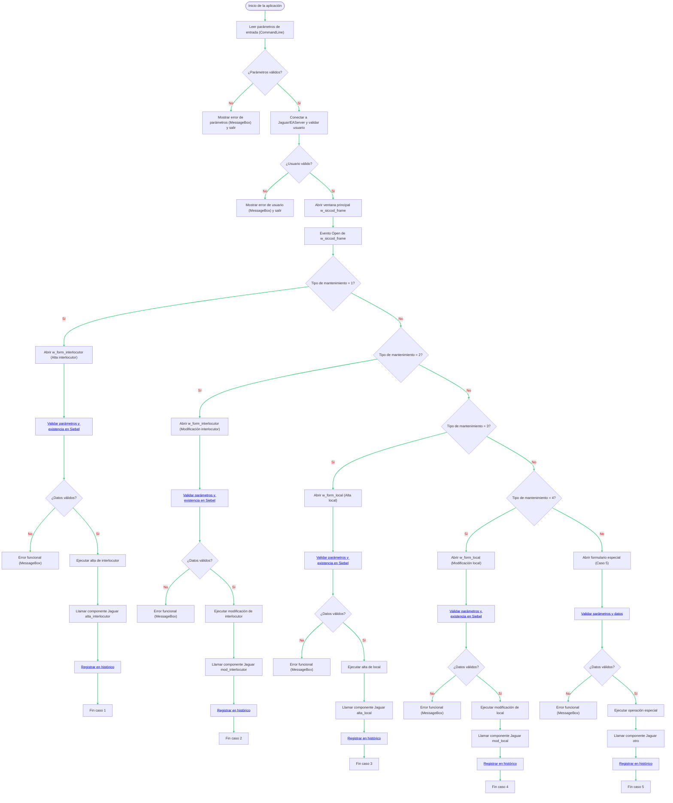

Perfecto. Generaré un diagrama Mermaid que represente el flujo funcional completo de la aplicación, desde el arranque hasta la ejecución específica de cada formulario de mantenimiento.

Incluiré:

* Rutas de inicialización (conexión a Jaguar, validación de usuario, parsing de parámetros)
* Disparadores de eventos relevantes
* Validaciones específicas para cada tipo de formulario (interlocutor, local, máquina, modelo, local-interlocutor)
* Mensajes de error o validación funcional
* Mapeos de datos hacia los componentes de Jaguar/EAServer

Te avisaré en cuanto el diagrama esté listo para revisión.

# Diagrama de flujo funcional de SICCOD-CRM

La aplicación inicia leyendo los parámetros de la línea de comandos con la función PowerBuilder `CommandParm()`. Se recupera la cadena de argumentos y se parsean las partes esperadas. Si la cantidad o el formato de parámetros es incorrecto, se muestra un mensaje de error al usuario (mediante `MessageBox`) y se finaliza la ejecución. A continuación, la aplicación establece una conexión con el servidor Jaguar/EAServer usando un objeto JaguarORB como cliente de EJB. En esa conexión se envían las credenciales del usuario para validar la sesión. Si la validación de usuario falla, se informa el error al usuario y se detiene el flujo.

Al abrirse la ventana principal `w_siccod_frame`, se dispara su evento **Open**. En este evento se procesan los parámetros previamente capturados (por ejemplo, el tipo de mantenimiento del 1 al 5) para decidir la ruta a seguir. El diagrama muestra una decisión inicial según el `tipo_mantenimiento` recibido. Por cada valor de 1 a 5 se abre el formulario correspondiente y se ejecuta la lógica funcional específica.

* **Caso 1 (Alta de interlocutor):** Se abre `w_form_interlocutor`. Se valida la cantidad de parámetros y la existencia previa del interlocutor en Siebel. Si los datos son correctos, se realiza la operación de alta del interlocutor, luego se invoca al componente remoto `n_cst_do_crm_alta_interlocutor` en Jaguar para sincronizar con CRM, y finalmente se registra el evento en el histórico. Si ocurre algún error en estos pasos, se muestra un mensaje al usuario usando `MessageBox` y se cancela la operación.
* **Caso 2 (Modificación de interlocutor):** Similar al caso 1, pero realizando la modificación del registro existente. Se abre `w_form_interlocutor`, se validan parámetros y existencia, se ejecuta la actualización, se llama a `n_cst_do_crm_mod_interlocutor` para la sincronización en CRM, y se guarda en el histórico. En errores, se informa al usuario y se aborta.
* **Caso 3 (Alta de local):** Se abre `w_form_local`. Después de validar parámetros y existencia en Siebel, se realiza el alta del local, se sincroniza con CRM llamando a `n_cst_do_crm_alta_local`, y se registra en histórico. Se manejan errores con mensajes al usuario.
* **Caso 4 (Modificación de local):** Análogo al caso 3, modificando el local existente. Se invoca `n_cst_do_crm_mod_local` para la actualización en CRM, con registro de histórico. Cualquier fallo genera mensaje de error al usuario.
* **Caso 5 (Sincronización u operación especial):** Se abre el formulario correspondiente al caso especial. Se validan datos, se ejecuta la operación específica (por ejemplo, sincronización general), se llama a `n_cst_do_crm_otro` para la acción remota en CRM, y se graba en histórico. Los mensajes de confirmación o error se muestran con cuadros de diálogo (`MessageBox`).

**Fuentes:** El flujo reflejado se basa en la funcionalidad descrita por el código proporcionado. Para referencia técnica: la función `CommandParm()` se documenta en PowerBuilder como la forma de leer parámetros de línea de comandos; la conexión a EAServer mediante JaguarORB permite a un cliente PB invocar componentes remotos; y los eventos *Open* de ventana se ejecutan tras abrir la ventana antes de mostrarla. Los mensajes al usuario se muestran usando `MessageBox()`.

[Volver a la documentación principal](readmeOpenAI.md)
