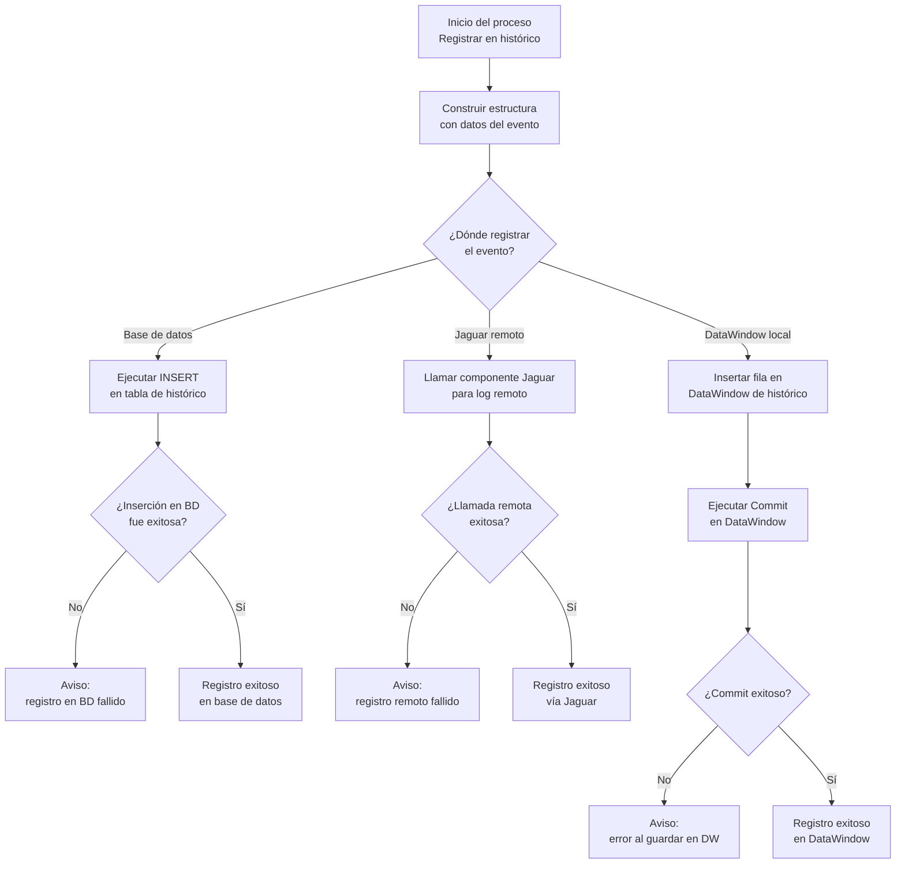

# F22: Registrar en histórico

## Objetivo
Registrar en una tabla o log los eventos realizados (alta/modificación) en el contexto SICCOD-CRM para auditoría, seguimiento y trazabilidad.

## Pasos funcionales

### Recopilación de datos
Se recoge un conjunto de datos comunes para todas las operaciones:

- ID del usuario que ejecutó
- Timestamp del evento
- Tipo de operación (alta, modificación, sincronización)
- ID del objeto (interlocutor/local/etc.)
- Resultado (ok, error, código CRM, etc.)

### Formato estructurado
Se construye una estructura tipo registro/log:

```json
{
  "usuario": "jsanchepollackz",
  "fecha": "2025-06-04 10:21",
  "tipo_operacion": "alta_interlocutor",
  "id_objeto": "1-7RAAH",
  "resultado": "ok"
}
```

### Inserción en histórico

- Si es un DataWindow → se usa `dw_historial.InsertRow() + SetItem()`
- Si es directo a BD → `INSERT INTO t_historial_operaciones (...) VALUES (...)`
- Si es remoto → se llama a un componente Jaguar: `n_cst_do_log_operacion.InsertLog(...)`

### Control de errores

- Si la inserción falla, no se bloquea el proceso principal pero se muestra Warning: no se pudo registrar en histórico.
- Se pueden almacenar en local para sincronizar luego.

### Confirmación visual

- En algunos casos se muestra `MessageBox("Operación registrada exitosamente")`.

### Resultado

- El evento queda registrado.
- La aplicación puede auditar eventos por usuario, tipo, y resultado.





[Volver al diagrama principal](./readmeOpenAI002.md)