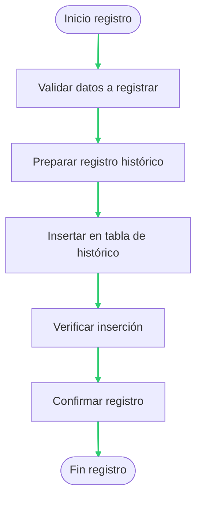

# Proceso de Registro en Histórico

## Descripción General

Este documento detalla el proceso de registro en el histórico de las operaciones realizadas en la aplicación SICCOD-CRM.

## Flujo de Registro

## Detalle del Proceso

### 1. Validación de Datos
- Verifica la integridad de los datos a registrar
- Comprueba la presencia de campos obligatorios
- Valida el formato de los datos

### 2. Preparación del Registro
- Formatea los datos según el esquema de histórico
- Añade metadatos (fecha, usuario, etc.)
- Prepara la transacción

### 3. Inserción en Histórico
- Ejecuta la inserción en la tabla de histórico
- Verifica la conexión a la base de datos
- Maneja posibles errores de inserción

### 4. Verificación
- Comprueba que el registro se ha insertado correctamente
- Valida la integridad de los datos insertados
- Verifica la consistencia del histórico

### 5. Confirmación
- Confirma la transacción
- Registra el éxito de la operación
- Notifica al usuario si es necesario

## Estructura del Histórico

| Campo | Tipo | Descripción |
|-------|------|-------------|
| ID | Integer | Identificador único del registro |
| Fecha | DateTime | Fecha y hora del registro |
| Usuario | String | Usuario que realiza la operación |
| Operación | String | Tipo de operación realizada |
| Datos | Text | Datos asociados a la operación |
| Estado | String | Estado del registro |

## Notas Técnicas

- El registro en histórico es una operación transaccional
- Se mantiene un log detallado de todas las operaciones
- Los registros son inmutables una vez creados
- Se implementa un sistema de backup automático

[Volver al diagrama principal](./readmeOpenAI002.md)