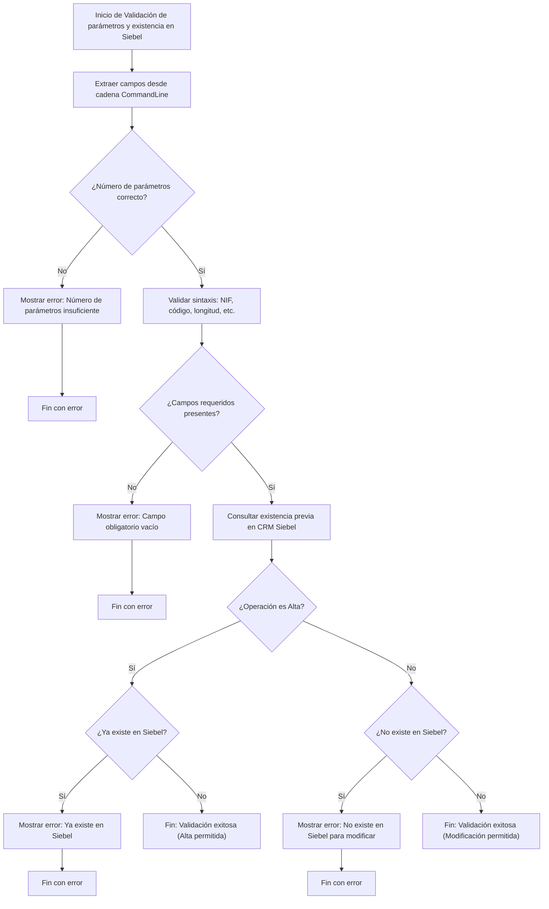

# Proceso de Validación de Parámetros y Existencia en Siebel

## Descripción General

Este documento detalla el proceso de validación de parámetros y verificación de existencia en Siebel CRM para la aplicación SICCOD-CRM.

## Flujo de Validación

**Nota:** El flujo de validación se ejecuta secuencialmente, verificando cada aspecto antes de proceder con la operación principal. Si alguna validación falla, se muestra un mensaje de error y se interrumpe el proceso.

## Detalle de Validaciones

### 1. Validación de Formato de Parámetros
- Verifica la estructura de la cadena de entrada
- Comprueba la presencia de campos obligatorios
- Valida el formato de los datos (fechas, números, etc.)

### 2. Verificación de Existencia en Siebel
- Consulta la existencia del registro en Siebel CRM
- Verifica la consistencia de los datos
- Comprueba el estado del registro

### 3. Validación de Permisos de Usuario
- Verifica los permisos del usuario en Siebel
- Comprueba el nivel de acceso requerido
- Valida las restricciones de seguridad

### 4. Comprobación de Integridad de Datos
- Verifica la consistencia de los datos
- Comprueba las reglas de negocio
- Valida las dependencias entre campos

### 5. Confirmación de Sincronización
- Verifica el estado de la sincronización
- Comprueba la integridad de la transacción
- Confirma el registro en el histórico

## Códigos de Retorno

| Código | Descripción |
|--------|-------------|
| 0 | Validación exitosa |
| 1 | Error en formato de parámetros |
| 2 | Registro no encontrado en Siebel |
| 3 | Usuario sin permisos |
| 4 | Error de integridad de datos |
| 5 | Error en sincronización |

## Notas Técnicas

- Las validaciones se ejecutan en secuencia
- Cada paso debe completarse exitosamente para continuar
- Los errores detienen el proceso y retornan el código correspondiente
- Se registran todas las validaciones en el log del sistema

[Volver al diagrama principal](./readmeOpenAI002.md)