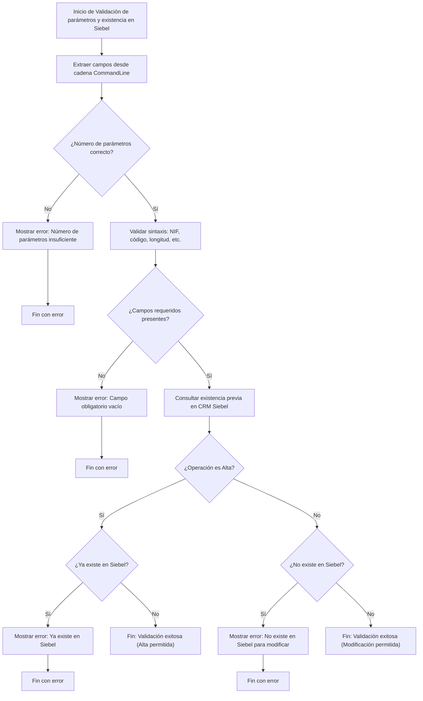

# Análisis funcional atómico: Validación de parámetros y existencia en Siebel

## Objetivo
Garantizar que la información enviada a la aplicación es suficiente, está bien formada, y corresponde con registros existentes (o ausentes, según el contexto) en el CRM Siebel.

## Pasos funcionales

### 1. Contar campos
- Se espera una cadena `CommandLine` con al menos N campos separados por `|`
- Cada tipo de operación (interlocutor, local, etc.) espera una estructura distinta

### 2. Mapeo de campos
Se mapean los campos del parámetro a variables internas:

**Para interlocutor:**
- `id_interlocutor`
- `nombre`
- `nif`

**Para local:**
- `codigo_local`
- `direccion`
- `cp`

### 3. Validaciones sintácticas
- NIF válido (formato/longitud)
- Código numérico correcto
- Campos obligatorios no vacíos

### 4. Consulta en Siebel
- Llamada a componente NVO `n_cst_so_permventana` o similar
- `EXISTS_IN_SIEBEL(id_interlocutor)` devuelve booleano o estado

### 5. Lógica de control
- Si se intenta alta y ya existe en Siebel → error
- Si se intenta modificación y no existe → error

### 6. Mensajes al usuario
- Si falla una validación, se muestra con `MessageBox("Error: campo obligatorio XYZ")`

## Resultado
- Si todo es correcto → se permite continuar
- Si hay error → se bloquea el flujo con código de retorno o salida del proceso

## Diagrama de flujo

[Volver al diagrama de flujo principal](./readmeOpenAI002.md)